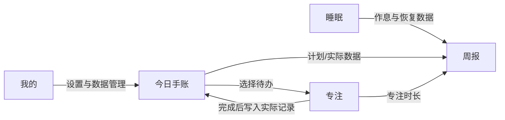

# 时间管理手账 · 产品需求文档（PRD）

| 文档信息 | |
|---|---|
| 产品名称 | 时间管理手账 / time-journal |
| 文档版本 | v1.1 |
| 修订日期 | 2026-07-03 |
| 文档状态 | 当前实现依据 |
| 目标平台 | iOS / Android 移动端，开发期支持 Flutter Web Server 预览 |

---

## 0. v1.1 修订说明

v1.0 以纸质 A5 工字四区手账为主要结构：待办 / 计划完成 / 实际完成 / 备注。

v1.1 保留纸质手账的方法论，但移动端 UI 不再机械复刻四区分栏。当前实现方向调整为：

> 帮用户看清：我原本打算怎么过，最后实际怎么过。

因此，首页从“计划完成”和“实际完成”两个独立大区块，收敛为“今日对照”时间线。计划和实际应在同一个时间块内对照展示，减少重复录入，降低手机端使用成本。

纸质工字布局仍作为设计来源；移动端当前实现以“待办事项 + 今日对照 + 今日统计 + 今天一句话”为准。

---

## 1. 文档概述

### 1.1 目的

本文档定义「时间管理手账」的产品定位、功能边界、模块规格、交互原则、数据约束与验收标准，作为产品设计、研发、测试和 Agent 改代码的统一依据。

### 1.2 背景

传统纸质手账能帮助用户把模糊目标拆解为具体行动，并通过“计划 vs 实际”的日复盘建立时间感知。本产品将这一方法迁移到手机端，并叠加专注计时与作息记录，形成“计划 → 执行 → 复盘 → 恢复”的轻量闭环。

### 1.3 产品语气

产品不评价用户，不羞辱用户，不把时间管理做成绩效考核。所有反馈应保持温和、低压力、可继续。

推荐语气：

- “看看时间去了哪里”
- “能留下痕迹就已经不错”
- “这一段守住了”
- “不是评价你这一周表现如何，而是看看这一周你是怎么过的”

避免语气：

- “你又失败了”
- “今日效率过低”
- “未达标”
- “拖延严重”

---

## 2. 产品定位

### 2.1 一句话定位

**一个低压力时间手账，用计划与实际的对照帮助用户看清自己的一天。**

### 2.2 价值主张

| 维度 | 用户痛点 | 产品价值 |
|---|---|---|
| 清晰力 | 想做很多事，但一天开始前不清楚重点 | 用待办和计划块形成清晰预期 |
| 执行力 | 计划容易和现实脱节 | 用今日对照看见偏差，而不是只勾选完成 |
| 专注力 | 学习/工作容易被打断 | 从待办发起专注，结束后回写实际记录 |
| 作息力 | 熬夜后难以复盘影响 | 用作息记录和睡眠分温和提示节奏 |

### 2.3 产品边界

产品应该像：

- 低压力时间手账
- 自我观察工具
- 计划与现实对照本
- 专注与作息的辅助工具

产品不应该变成：

- 重型任务管理器
- KPI 绩效看板
- 积分排行榜工具
- 社交打卡产品
- 复杂 AI 评价系统

### 2.4 核心原则

1. **少填**：能自动生成的，不让用户重复写。
2. **少点**：高频动作不超过两步。
3. **对照**：计划和实际必须放在一起看。
4. **克制**：不过度游戏化、不过度统计化。
5. **温和**：只帮助用户看清自己，不对用户下评价。

---

## 3. 目标用户

### 3.1 核心用户画像

**画像 A：备考学生（18–25 岁）**

- 日均学习时间长，容易被手机打断
- 想规划一天，但很难稳定执行
- 希望复盘自己真实的时间流向
- 喜欢纸质手账感，但手机记录更方便

**画像 B：职场学习者（25–35 岁）**

- 利用碎片时间学习或做副业
- 不想维护复杂项目管理系统
- 需要轻量统计与温和复盘

### 3.2 需求优先级

```text
P0：今日手账记录与计划/实际对照
P0：番茄专注与手账任务联动
P1：睡眠提醒、睡眠记录与白噪音
P1：周回顾与节奏热力图
P2：导出、更多白噪音、睡前仪式、历史增强
```

---

## 4. 产品架构

### 4.1 信息架构

```text
时间管理手账 App
├── 手账：首页、待办、今日对照、统计、今天一句话
├── 专注：任务选择、倒计时、专注中、完成反馈
├── 睡眠：作息目标、我准备睡了、白噪音、今日记录
├── 周报：周节奏热力图、计划/实际/专注/睡眠回顾
└── 我的：设置、数据存储、关于、导出/清空数据
```

### 4.2 模块关系



### 4.3 核心用户旅程

1. **晨间**：打开手账 → 写今日待办 → 安排计划时间段。
2. **日间**：从待办或计划块开始专注 → 完成后记入实际记录。
3. **晚上**：查看今日对照 → 对偏差做一句话复盘 → 睡前记录作息。
4. **周末**：查看周节奏热力图 → 看见哪些天记录了、专注了、早睡了。

---

## 5. 功能需求详述

---

### 5.1 模块一：手账 / 今日对照

#### 5.1.1 功能目标

通过“待办 → 计划 → 实际 → 对照 → 一句话复盘”，让用户以最低成本看清一天的计划和现实差异。

#### 5.1.2 当前移动端首页结构

```text
┌─────────────────────────────┐
│ 日期 + 今日状态              │
├─────────────────────────────┤
│ 待办事项                    │
│ □ 背英语                    │
│ □ 复习内科                  │
│ [添加待办]                  │
├─────────────────────────────┤
│ 今日对照                    │
│ 看看计划和现实差在哪里       │
│ 09:00-10:00                 │
│ 计划：背英语                 │
│ 实际：背英语                 │
│ 状态：一致                  │
│ [按计划完成] [实际有变]      │
├─────────────────────────────┤
│ 今日统计                    │
│ 计划学习 2 小时              │
│ 实际学习 3 小时              │
│ 专注 25 分钟                 │
├─────────────────────────────┤
│ 今天一句话                  │
└─────────────────────────────┘
```

#### 5.1.3 功能规格

| 编号 | 功能点 | 详细说明 | 优先级 |
|---|---|---|---|
| H-01 | 日期展示 | 默认今日，支持切换日期；历史日期加载对应数据 | P0 |
| H-02 | 待办事项 | 添加、编辑、删除、完成状态；首页默认显示前 5 条，超出折叠 | P0 |
| H-03 | 安排待办 | 点击待办后通过底部面板执行：安排到时间段 / 开始专注 / 标为完成 / 删除 | P0 |
| H-04 | 计划时间块 | 每条记录包含开始时间、结束时间、计划内容、关联待办 | P0 |
| H-05 | 今日对照 | 在同一时间块展示计划与实际，不再把二者作为完全独立大区块 | P0 |
| H-06 | 按计划完成 | 用户点击后，自动生成对应实际记录，内容与时间默认继承计划 | P0 |
| H-07 | 实际有变 | 用户点击后编辑实际时间/内容，可保留原计划作为对照 | P0 |
| H-08 | 专注回写 | 专注完成后可一键写入今日实际记录 | P0 |
| H-09 | 今日统计 | 自动统计计划时长、实际时长、专注时长；单位清晰，如 120 分钟 / 2 小时 | P0 |
| H-10 | 今天一句话 | 简短自由文本，用于感受、反思、明日提示 | P0 |
| H-11 | 当前时间段提示 | 根据当前时间高亮正在发生或待补记的时间段 | P1 |
| H-12 | 自动保存 | 输入防抖保存，切后台不丢数据 | P0 |
| H-13 | 历史浏览 | 日历或日期切换查看往日手账 | P1 |
| H-14 | 导出 | 后续支持 Markdown / CSV / 图片导出 | P2 |

#### 5.1.4 交互细节

**待办事项**

- 列表保持轻，不在每一行塞过多图标。
- 点击待办打开底部面板。
- 不优先做拖拽；拖拽可作为后续增强。
- 待办超过 5 条时默认折叠，避免首页压迫感。

**计划块**

- 新建计划块时选择开始/结束时间和内容。
- 计划块下方保留两个轻按钮：“按计划完成”“实际有变”。
- “按计划完成”应一键生成实际记录，减少重复输入。
- “实际有变”进入编辑实际记录流程。

**今日对照**

- 状态可分为：一致、待补、偏差、有新增实际。
- 不用红色大量警告；偏差只作为事实提示。
- 当前时间段可弱高亮，非当前项可适度弱化。

**今天一句话**

- 文案定位为手账备注，不写“绩效总结”。
- 推荐 placeholder：`今天留下了什么痕迹？`

#### 5.1.5 数据模型建议

现有 Drift 表以代码为准。概念模型如下：

```text
DailyJournal {
  id
  date
  todos
  plannedBlocks
  actualBlocks
  focusSessions
  note
  createdAt
  updatedAt
}

TodoItem {
  id
  journalId
  content
  completed
  order
}

TimeBlock {
  id
  journalId
  source: planned | actual
  startTime
  endTime
  content
  linkedTodoId?
  linkedPlanBlockId?
}

FocusSession {
  id
  journalId
  linkedTodoId?
  startedAt
  endedAt
  durationMinutes
  completed
  interruptions
}
```

涉及 Drift schema 变更时必须说明 migration，不得为了通过编译清空或删除用户数据。

#### 5.1.6 验收标准

- [ ] 首页不再出现两个完全独立的大区块“计划完成 / 实际完成”。
- [ ] 同一时间块能同时展示计划与实际。
- [ ] 点击“按计划完成”能生成实际记录。
- [ ] 点击“实际有变”能记录与计划不同的实际内容。
- [ ] 今日统计分钟数计算正确，误差 ≤1 分钟。
- [ ] 切换日期不会串数据。
- [ ] 运行 `flutter analyze` 无新增错误。

---

### 5.2 模块二：专注 / 番茄钟

#### 5.2.1 功能目标

让专注不是孤立计时器，而是和今日待办、今日实际记录形成闭环。

#### 5.2.2 页面结构

```text
专注

今天专注哪一件事？
[ 输入任务 ]

从今日待办中选择
[ 背英语 ] [ 复习内科 ]

25:00
[5分钟] [15分钟] [25分钟] [45分钟]

[开始专注 25 分钟]
```

#### 5.2.3 功能规格

| 编号 | 功能点 | 详细说明 | 优先级 |
|---|---|---|---|
| P-01 | 时长预设 | 5 / 15 / 25 / 45 分钟；支持自定义 | P0 |
| P-02 | 任务选择 | 可输入临时任务，也可从今日待办选择 | P0 |
| P-03 | 倒计时 | 显示大号倒计时，支持暂停/继续 | P0 |
| P-04 | 专注中页面 | 深色页面，显示当前任务、剩余时间、克制退出入口 | P0 |
| P-05 | 放弃确认 | 放弃专注需要二次确认或长按确认 | P0 |
| P-06 | 完成反馈 | 专注完成后显示“记入今天 / 补一句备注” | P0 |
| P-07 | 写入实际记录 | 点击“记入今天”后写入今日实际记录 | P0 |
| P-08 | 专注统计 | 记录每日/每周专注次数、总时长、中断次数 | P1 |
| P-09 | 白噪音 | 后续可在专注中播放轻背景音 | P2 |

#### 5.2.4 验收标准

- [ ] 可选择今日待办作为专注任务。
- [ ] 专注中显示任务名。
- [ ] 放弃专注不误触。
- [ ] 完成后能把时长写入今日实际记录。
- [ ] 完成反馈文案温和，不做过度游戏化奖励。

---

### 5.3 模块三：睡眠

#### 5.3.1 功能目标

用低压力方式帮助用户记录作息、辅助入睡，并在周报中看见自己的恢复节奏。

#### 5.3.2 页面结构

```text
睡眠

今晚目标
23:00 睡 / 07:00 起

[我准备去睡了]

白噪音
[雨声] [海浪] [篝火] [风声]

今日记录
就寝：未记录
起床：未记录
```

#### 5.3.3 功能规格

| 编号 | 功能点 | 详细说明 | 优先级 |
|---|---|---|---|
| S-01 | 作息目标 | 设定目标就寝和起床时间 | P0 |
| S-02 | 就寝提醒 | 温和提醒，不恐吓、不羞辱 | P0 |
| S-03 | 就寝打卡 | 一键“我准备去睡了”记录时间 | P0 |
| S-04 | 起床记录 | 手动或提醒后记录起床时间 | P0 |
| S-05 | 睡眠分 | 根据目标偏差做温和分数反馈，不能出现负分羞辱 | P1 |
| S-06 | 白噪音 | 播放/停止/选中态/定时关闭 | P1 |
| S-07 | 睡眠周报 | 一周就寝、起床、早睡率等节奏展示 | P1 |
| S-08 | 养成场景 | 只做轻量视觉反馈，不做重游戏化 | P2 |

#### 5.3.4 视觉约束

- 睡眠模块可以使用低饱和灰蓝、雾蓝、深奶蓝。
- 不使用高饱和商务蓝。
- 星星、点灯、进度等视觉反馈应克制。
- 白噪音按钮需要选中态、播放状态和停止入口。

#### 5.3.5 验收标准

- [ ] 主操作“我准备去睡了”在睡眠页第一屏可见。
- [ ] 白噪音有明确播放/停止状态。
- [ ] 睡眠记录空状态温和。
- [ ] 睡眠分不使用惩罚性文案。

---

### 5.4 模块四：周报

#### 5.4.1 功能目标

帮助用户一眼看见这一周的节奏，而不是堆复杂图表。

#### 5.4.2 推荐结构

```text
一周手账
不是「这周表现如何」
而是「这一周，你是怎么过的」

这一周的节奏
        一  二  三  四  五  六  日
手账    □  ■  ■  □  ■  □  □
专注    ■  □  ■  □  □  □  □
早睡    □  □  ■  ■  □  □  □

数字只是镜子，帮你看清自己；怎么调整，只有你知道。
```

#### 5.4.3 功能规格

| 编号 | 功能点 | 详细说明 | 优先级 |
|---|---|---|---|
| W-01 | 节奏热力图 | 按周展示手账、专注、早睡是否发生 | P1 |
| W-02 | 周统计 | 汇总计划时长、实际时长、专注时长、记录天数 | P1 |
| W-03 | 温和文案 | 不评价表现，只描述记录痕迹 | P1 |
| W-04 | 历史周切换 | 后续支持查看过去周报 | P2 |

#### 5.4.4 验收标准

- [ ] 用户能一眼看出哪天记录了、哪天专注了、哪天早睡了。
- [ ] 空状态文案温和。
- [ ] 图表不过度复杂，不做 KPI 评分榜。

---

### 5.5 模块五：我的 / 设置

#### 5.5.1 功能目标

提供清晰的设置与数据管理入口，不在“我的”页堆大段说明文字。

#### 5.5.2 页面结构

```text
我的

一周手账
这一周，你是怎么过的      >

数据存储
所有记录都保存在本机      >

关于
时间管理手账 v1.0.0       >

设置
主题 / 导出 / 清空数据     >
```

#### 5.5.3 功能规格

| 编号 | 功能点 | 详细说明 | 优先级 |
|---|---|---|---|
| M-01 | 设置列表 | 左图标 + 标题 + 副标题 + 右箭头 | P1 |
| M-02 | 数据存储说明 | 明确默认本地保存，无云端 | P1 |
| M-03 | 清空数据 | 高风险操作必须二次确认 | P1 |
| M-04 | 导出数据 | Markdown / CSV 后续实现 | P2 |
| M-05 | 关于 | 版本号、隐私说明、开源/素材声明 | P1 |

---

## 6. 非功能需求

### 6.1 性能

| 指标 | 要求 |
|---|---|
| 冷启动 | 中端机 ≤2 秒，开发期可放宽 |
| 自动保存 | 用户无感知，输入后防抖保存 |
| 计时精度 | 误差 ≤1 秒/小时 |
| 离线可用 | 核心手账、专注、睡眠均离线可用 |

### 6.2 数据与隐私

- 数据默认仅存本机 SQLite。
- 不引入账号、云同步、后端，除非用户明确要求。
- 不采集通讯录、位置等无关权限。
- 清空数据必须二次确认。
- 涉及数据库 schema 变更时必须提供 migration 说明。

### 6.3 兼容性

- 目标：iOS / Android 移动端竖屏。
- 开发期：支持 Flutter Web Server 预览。
- MVP 不要求横屏和平板深度适配。

### 6.4 无障碍

- 支持系统字体缩放。
- 主要按钮触控区域 ≥44×44 pt。
- 颜色不能作为唯一状态表达；需配合文字状态。

---

## 7. 视觉与交互规范

### 7.1 设计风格

- 基调：暖白纸面、低压力、手账感、现代移动端清晰度。
- 页面背景：暖米白。
- 卡片背景：接近白色的奶油色。
- 文字：深墨色。
- 强调：红棕主色 / 墨绿色辅助强调。
- 睡眠：低饱和灰蓝。

### 7.2 卡片系统

| 项 | 建议 |
|---|---|
| 页面边距 | 16 |
| 卡片圆角 | 16 |
| 卡片内边距 | 14–16 |
| 卡片间距 | 12–16 |
| 边框 | 浅米灰 1px |
| 阴影 | 弱化或不用明显阴影 |

### 7.3 标题系统

模块标题前的小红竖线保留，但要组件化统一：

| 项 | 建议 |
|---|---|
| 竖线宽度 | 3 |
| 竖线高度 | 16 |
| 竖线圆角 | 2 |
| 标题字号 | 16–18 |
| 标题字重 | 600 / 700 |

### 7.4 颜色使用

红棕色只用于主操作、当前选中、品牌强调。普通标签使用米灰背景 + 深灰文字。危险/删除操作不要复用主红棕，需单独设计。

### 7.5 字体层级

| 场景 | 建议 |
|---|---|
| 页面标题 | 24 / 700 |
| 模块标题 | 17 / 700 |
| 正文 | 15–16 |
| 副文案 | 13 |
| 时间标签 | 20–24 / 700 |
| 专注倒计时 | 72–88 |
| 按钮文字 | 16 / 600 |

---

## 8. 版本规划

### 8.1 当前 MVP 收口

目标：验证“手账 + 专注 + 睡眠”的轻量闭环。

| 模块 | 当前重点 |
|---|---|
| 手账 | 今日对照、按计划完成、实际有变、今日统计 |
| 专注 | 任务感、专注中页、完成后写入实际记录 |
| 睡眠 | 主按钮前置、白噪音状态、温和睡眠记录 |
| 周报 | 节奏热力图 |
| 我的 | 设置列表化 |

### 8.2 v1.1

- 当前时间段高亮。
- 自动补记刚刚这一段。
- 滚轮时间选择器。
- 历史日历增强。
- 数据导出 Markdown / CSV。

### 8.3 v1.2

- 白噪音定时关闭与更多声音。
- 睡前仪式。
- 周报历史。
- 轻量养成视觉。

### 8.4 暂不做

- 复杂标签系统。
- 四象限任务管理。
- 积分等级排行榜。
- 社交分享排名。
- AI 自动评价用户今天好不好。
- 云同步和账号系统，除非用户明确要求。

---

## 9. 验收与测试

### 9.1 基础验证命令

所有 Flutter 命令在 `app/` 下执行：

```bash
cd app
flutter pub get
flutter analyze
flutter test
```

开发期 Web 预览：

```bash
cd app
flutter run -d web-server --web-hostname 0.0.0.0 --web-port 8080
```

### 9.2 数据库变更验证

涉及 Drift schema 变更：

```bash
cd app
dart run build_runner build --delete-conflicting-outputs
flutter analyze
flutter test
```

并必须说明：

1. 是否新增/删除/改名表或字段。
2. 是否需要 migration。
3. 是否影响已有用户数据。
4. 如何回滚或兼容旧数据。

---

## 10. 风险与对策

| 风险 | 影响 | 对策 |
|---|---|---|
| 继续复刻纸质四区导致手机端繁琐 | 用户重复录入 | 以“今日对照”替代双栏独立录入 |
| 功能三角过大 | MVP 延期 | 当前版本只做闭环，不扩张社交、云同步、重养成 |
| 睡眠游戏化过重 | 产品变吵 | 睡眠只做温和反馈和低饱和视觉 |
| Drift 变更不当 | 用户本地数据丢失 | schema 变更必须 migration，不得清库 |
| 手机 Termux 构建不完整 | 本地 release 失败 | 手机侧只做轻量开发和 Web 预览，release 交给电脑/云端 |

---

## 11. 开放问题

| # | 问题 | 当前建议 |
|---|---|---|
| 1 | 产品正式名称是否继续叫“时间管理手账”？ | 暂定继续使用 |
| 2 | 是否需要账号体系？ | MVP 不做 |
| 3 | 计划与实际是否保留底层双表？ | 可保留底层结构，但 UI 统一为今日对照 |
| 4 | 睡眠视觉隐喻选星空、小镇还是植物？ | 当前用低饱和睡眠卡片，养成隐喻后置 |
| 5 | 是否支持横屏？ | MVP 仅竖屏 |
| 6 | 是否接 AI 复盘？ | 暂不做自动评价，后续可做“温和总结草稿” |

---

## 12. 附录：纸质手账迁移对照

| 纸质操作 | 移动端 v1.1 实现 |
|---|---|
| A5 竖对折卡片 | 单页滚动首页 |
| 左上写待办 | 待办事项卡片 |
| 左侧写计划 | 计划时间块 |
| 右侧写实际 | 今日对照中的实际字段 |
| 计划/实际分栏对比 | 同一时间块内计划 vs 实际 |
| 底部备注 | 今天一句话 |
| 汇总学习时间 | 今日统计 |
| 翻阅旧本子 | 日期切换 / 历史日历 |

---

*文档结束*
