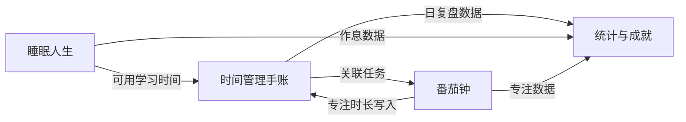

# 时间管理手账 · 产品需求文档（PRD）

| 文档信息 | |
|---|---|
| 产品名称 | 时间管理手账 |
| 文档版本 | v1.0 |
| 创建日期 | 2026-06-22 |
| 文档状态 | 初稿 |
| 目标平台 | iOS / Android 移动端 |

---

## 1. 文档概述

### 1.1 目的

本文档定义「时间管理手账」移动应用的产品定位、目标用户、核心功能规格、交互设计、技术约束与迭代路线，作为产品设计、研发、测试与验收的统一依据。

### 1.2 背景

传统纸质 A5 竖对折手账已被验证能有效提升「清晰力」——将模糊目标拆解为可执行的具体行动，并通过「计划 vs 实际」的日复盘形成时间感知。本产品将这一方法论迁移至移动端，并叠加番茄专注与睡眠养成能力，形成「清晰 → 专注 → 恢复」的完整执行力闭环。

### 1.3 术语表

| 术语 | 定义 |
|---|---|
| 清晰力 | 将目标细化、具体化的能力；行动力需以清晰力为支撑 |
| 工字布局 | 手账四区结构：待办（上）、计划完成（左下）、实际完成（右下）、备注（底） |
| 专注模式 | 番茄钟运行期间的系统级防干扰状态 |
| 睡眠养成 | 通过游戏化机制激励用户规律作息、早睡早起的长期行为 |

---

## 2. 产品定位

### 2.1 一句话定位

**一个帮助提升执行力、养成专注、规范作息的移动应用。**

### 2.2 价值主张

| 维度 | 用户痛点 | 产品价值 |
|---|---|---|
| 执行力 | 知道要做什么，但不知道从何下手 | 手账四区法强制拆解与排序，建立每日清晰力 |
| 专注力 | 学习易分心，难以持续深度工作 | 番茄钟 + 专注锁屏，培养「极度专注、主动休息」节律 |
| 作息力 | 熬夜成瘾，生物钟紊乱 | 睡眠人生将早睡转化为可积累、可成长的养成游戏 |

### 2.3 产品愿景

成为学生与知识工作者「每日计划 → 深度专注 → 高质量恢复」的首选工具，让时间管理从「记录」升级为「训练」。

### 2.4 竞品差异化

- **vs 纯待办 App（滴答清单、Todoist）**：强调「计划/实际对比复盘」，而非仅勾选完成
- **vs 纯番茄 App（Forest、专注森林）**：与当日手账任务联动，专注有上下文
- **vs 纯睡眠 App（小睡眠、潮汐）**：白噪音为辅助，核心是作息养成游戏与数据反馈

---

## 3. 目标用户

### 3.1 核心用户画像

**画像 A：备考学生（18–25 岁）**
- 日均学习 4–8 小时，易受手机消息干扰
- 有记手账习惯或认同手账方法论
- 作息不规律，常熬夜刷题/刷视频

**画像 B：职场学习者（25–35 岁）**
- 利用碎片时间提升技能
- 需要可量化的专注时长与复盘数据
- 希望低成本、低仪式感地维持自律

### 3.2 用户需求优先级

```
P0：每日手账记录与复盘
P0：番茄专注与防干扰
P1：睡眠提醒与作息统计
P2：白噪音、成就系统、数据周报
```

---

## 4. 产品架构

### 4.1 信息架构

```
时间管理手账 App
├── 首页（今日手账）
├── 番茄钟
├── 睡眠人生
├── 历史记录 / 日历
└── 我的（设置、统计、成就）
```

### 4.2 功能模块关系



### 4.3 核心用户旅程

1. **晨间**：打开 App → 填写今日待办 → 按重要性编号排序 → 在「计划完成」区按时间段排布
2. **日间**：从待办发起番茄专注 → 进入专注锁屏 → 完成后自动记入实际完成
3. **夜间**：对照计划与实际复盘 → 填写备注 → 设定就寝提醒 → 睡眠人生结算当日「早睡分」

---

## 5. 功能需求详述

---

### 5.1 模块一：时间管理手账

#### 5.1.1 功能目标

建立清晰力：通过「待办罗列 → 优先级排序 → 时间段计划 → 实际记录 → 日复盘」五步法，让用户每日行动有据可依。

#### 5.1.2 设计参考

迁移自纸质 A5 竖对折卡片（见图 6-3 日程规划）：

1. 取 A5 卡片纸竖对折
2. 左上区域写下当日全部待办，清空大脑后按重要性编号
3. 左侧按时间段预测性填写计划；底部汇总「计划学习时间」与「可用学习时间」
4. 右侧记录实际完成情况；日复盘对比计划与实际，时间利用效率一目了然

#### 5.1.3 界面布局（工字结构）

```
┌─────────────────────────────────────┐
│  📅 2026年6月22日  星期一              │
├─────────────────────────────────────┤
│  待办事项                             │
│  ① ________________________________  │
│  ② ________________________________  │
│  ③ ________________________________  │
│  [+ 添加待办]                         │
├──────────────────┬──────────────────┤
│  计划完成          │  实际完成          │
│  08:00-09:00      │  08:00-09:30      │
│  _______________  │  _______________  │
│  09:30-11:00      │  09:30-10:45      │
│  _______________  │  _______________  │
│  [+ 添加时段]      │  [+ 添加时段]      │
├──────────────────┴──────────────────┤
│  计划学习时间：4h    可用学习时间：6h    │
├─────────────────────────────────────┤
│  备注                                 │
│  ____________________________________ │
│  ____________________________________ │
└─────────────────────────────────────┘
```

#### 5.1.4 功能规格

| 编号 | 功能点 | 详细说明 | 优先级 |
|---|---|---|---|
| H-01 | 日期展示 | 默认今日，支持左右滑动切换日期；支持日历跳转历史/未来日期 | P0 |
| H-02 | 待办事项编辑 | 自由文本输入；支持添加/删除/拖拽排序；支持重要性编号（①②③或 1/2/3） | P0 |
| H-03 | 待办完成勾选 | 可选勾选框标记完成，完成项视觉弱化（删除线/灰色） | P1 |
| H-04 | 计划完成区 | 每条记录 = 时间段 + 文本描述；时间段通过时间选择器设定起止时间 | P0 |
| H-05 | 实际完成区 | 结构同计划完成；支持一键从计划区复制到实际区再修改 | P0 |
| H-06 | 时间统计 | 底部自动汇总计划区总时长、实际区总时长；可选手动填写「可用学习时间」 | P0 |
| H-07 | 备注区 | 多行自由文本，用于感受、反思、明日提示等 | P0 |
| H-08 | 自适应高度 | 四个板块随内容自动增高，无字数/条数上限，不出现写不下的情况 | P0 |
| H-09 | 自动保存 | 输入防抖 500ms 后本地持久化；切后台/杀进程不丢数据 | P0 |
| H-10 | 关联番茄钟 | 待办项可一键「开始专注」，完成后回写实际完成区 | P1 |
| H-11 | 历史浏览 | 日历视图查看往日手账，支持只读浏览 | P1 |
| H-12 | 导出/分享 | 将当日手账导出为图片分享（还原工字版式） | P2 |

#### 5.1.5 交互细节

**待办事项**
- 点击空白行即创建新待办
- 长按拖拽调整顺序，松手后自动重编号
- 删除：左滑删除或编辑模式批量删除

**计划完成 / 实际完成**
- 点击「+ 添加时段」→ 弹出时间段选择器（起始时间、结束时间）→ 输入内容
- 时间段校验：结束时间 > 起始时间；同区时段重叠时黄色警告（允许保存，不阻断）
- 「从计划复制」：将计划区全部条目复制到实际区作为草稿

**自适应高度规则**
- 单行输入框随文字换行自动增高
- 列表区每增加一条，容器高度 +1 行
- 整页可纵向滚动，工字结构分区边框固定可见

#### 5.1.6 数据模型

```
DailyJournal {
  id: string
  date: YYYY-MM-DD
  todos: TodoItem[]
  plannedBlocks: TimeBlock[]
  actualBlocks: TimeBlock[]
  plannedStudyMinutes: number      // 自动计算
  availableStudyMinutes: number?   // 用户手填
  notes: string
  createdAt: timestamp
  updatedAt: timestamp
}

TodoItem {
  id: string
  content: string
  priority: number
  completed: boolean
  order: number
}

TimeBlock {
  id: string
  startTime: HH:mm
  endTime: HH:mm
  content: string
  linkedTodoId?: string
  source: 'planned' | 'actual'
}
```

#### 5.1.7 验收标准

- [ ] 单日可添加 ≥50 条待办、≥30 个时段，界面无截断、无溢出
- [ ] 四区内容编辑流畅，自动保存成功率 100%
- [ ] 计划/实际时长汇总误差 ≤1 分钟
- [ ] 切换日期后正确加载对应手账，无数据串页

---

### 5.2 模块二：番茄钟

#### 5.2.1 功能目标

让用户养成「极度专注、主动休息、循环往复」的学习模式，获取极度专注的能力，有效提高学习耐力。

#### 5.2.2 界面结构

```
┌─────────────────────────────────────┐
│           🍅 番茄钟                   │
├─────────────────────────────────────┤
│         ┌─────────────┐              │
│         │   25:00     │  ← 大号倒计时  │
│         └─────────────┘              │
│                                      │
│   [5分] [15分] [25分] [45分] [自定义]  │
│                                      │
│   关联任务：① 复习高数第三章           │
│                                      │
│        [ 开始专注 ]                   │
└─────────────────────────────────────┘
```

#### 5.2.3 功能规格

| 编号 | 功能点 | 详细说明 | 优先级 |
|---|---|---|---|
| P-01 | 时长预设 | 快捷按钮：5 / 15 / 25 / 45 分钟；支持自定义 1–120 分钟 | P0 |
| P-02 | 倒计时 | 大号数字倒计时；支持暂停/继续；剩余 ≤1 分钟时轻微震动提醒 | P0 |
| P-03 | 专注模式（锁屏） | 开启后进入全屏专注界面，屏蔽 App 内导航；尝试退出时二次确认 | P0 |
| P-04 | 系统级防干扰 | Android：勿扰模式引导/自动开启；iOS：引导开启专注模式或通知屏蔽 | P0 |
| P-05 | 禁止切换应用 | 检测到切出 App 时暂停计时并记录中断次数；可选「严格模式」切出即失败 | P1 |
| P-06 | 休息阶段 | 专注结束后自动进入休息（默认 5 分钟，可配置）；休息结束提醒 | P0 |
| P-07 | 关联手账任务 | 可从待办选择关联任务；完成后写入手账「实际完成」区 | P1 |
| P-08 | 白噪音（专注中） | 可选雨声/咖啡厅等背景音，专注期间播放 | P2 |
| P-09 | 专注统计 | 记录每日/每周专注次数、总时长、中断次数 | P1 |
| P-10 | 完成反馈 | 专注结束动画 + 鼓励文案；长专注（≥45min）额外成就提示 | P2 |

#### 5.2.4 专注模式（Focus Mode）规格

**进入条件**：用户点击「开始专注」并确认

**专注中界面**
- 全屏深色背景，仅显示：倒计时、关联任务名、暂停按钮
- 隐藏底部 Tab、侧滑返回（Android 拦截返回键，iOS 拦截边缘手势需系统配合）
- 屏幕常亮（可配置）

**防干扰策略（分平台）**

| 策略 | iOS | Android |
|---|---|---|
| App 内锁屏 | ✅ 全屏遮罩 | ✅ 全屏遮罩 |
| 屏蔽推送 | 引导用户开启系统专注模式 / 通知摘要 | 请求 DND 权限或引导手动开启 |
| 切出检测 | 进入后台时暂停 + 记录 | 同左 |
| 来电处理 | 不阻断系统来电；结束后提示是否继续 | 同左 |

**退出专注**
- 普通模式：长按 3 秒「放弃专注」按钮
- 严格模式：放弃后本次不计入有效专注，并记录失败

#### 5.2.5 状态机

```
Idle → Running → (Paused ↔ Running) → Break → Idle
                  ↓ 放弃
                Abandoned → Idle
```

#### 5.2.6 验收标准

- [ ] 预设与自定义时长均可正常倒计时，误差 ≤1 秒/小时
- [ ] 专注模式期间无法通过常规操作切换 Tab
- [ ] 专注完成后正确触发休息阶段
- [ ] 关联任务时，结束后自动在手账实际区新增对应时段记录

---

### 5.3 模块三：睡眠人生

#### 5.3.1 功能目标

将睡觉养成游戏，规范作息生物钟，让用户拥有能够早睡的能力。

#### 5.3.2 设计思路（解决「怎么融入睡觉养成」）

睡眠不应只是「闹钟 + 白噪音」，而应形成 **「目标 → 行为 → 反馈 → 成长」** 的游戏闭环：

```
设定就寝目标 → 睡前仪式提醒 → 入睡/起床打卡 → 结算「睡眠分」→ 养成角色/场景成长
```

**核心游戏隐喻：「睡眠小镇」或「星空旅人」**

用户拥有一个随作息质量而变化的虚拟空间：
- **早睡** → 小镇点亮一盏灯 / 星空多一颗星
- **连续早睡** → 建筑升级、角色解锁、白噪音场景解锁
- **熬夜** → 小镇迷雾、角色疲惫（软性惩罚，不羞辱）
- **规律作息** → 生物钟等级提升，解锁更高阶奖励

这样白噪音、提醒、统计都服务于「让小镇变美好」，而非孤立功能。

#### 5.3.3 界面结构

```
┌─────────────────────────────────────┐
│           🌙 睡眠人生                 │
├─────────────────────────────────────┤
│      [星空小镇 / 养成场景动画]          │
│      生物钟 Lv.3  ·  连续早睡 5 天     │
├─────────────────────────────────────┤
│  今晚目标就寝：23:00    [修改]         │
│  明早起床：07:00        [修改]         │
├─────────────────────────────────────┤
│  🎵 白噪音                             │
│  [雨声] [海浪] [篝火] [更多...]        │
│  定时关闭：30分钟 / 60分钟 / 跟随入睡    │
├─────────────────────────────────────┤
│  睡前仪式（可选）                       │
│  ☑ 22:30 放下手机提醒                  │
│  ☑ 22:45 白噪音自动播放                │
│  ☑ 23:00 就寝打卡                      │
├─────────────────────────────────────┤
│  [ 我准备睡了 ]  ← 就寝打卡             │
└─────────────────────────────────────┘
```

#### 5.3.4 功能规格

| 编号 | 功能点 | 详细说明 | 优先级 |
|---|---|---|---|
| S-01 | 作息时间设定 | 设定目标就寝时间、起床时间；支持工作日/周末不同 schedule | P0 |
| S-02 | 就寝提醒 | 就寝前 30/15/5 分钟可选提醒；文案温和，非恐吓式 | P0 |
| S-03 | 起床提醒 | 闹钟式起床提醒；支持贪睡次数限制（养成向：贪睡扣睡眠分） | P0 |
| S-04 | 就寝打卡 | 用户主动点击「我准备睡了」记录实际就寝时间 | P0 |
| S-05 | 起床打卡 | 关闭起床闹钟时自动记录起床时间 | P0 |
| S-06 | 睡眠分结算 | 每日根据就寝/起床时间与目标偏差计算分数（见 5.3.5） | P0 |
| S-07 | 连续早睡 streak | 连续在目标时间 ±30 分钟内就寝，累计 streak 天数 | P0 |
| S-08 | 养成场景 | 睡眠分/ streak 驱动场景变化（点灯、升级、解锁） | P1 |
| S-09 | 白噪音 | 内置 ≥6 种白噪音；支持后台播放、定时关闭 | P1 |
| S-10 | 睡前仪式 | 用户自定义 1–3 个睡前步骤及触发时间 | P1 |
| S-11 | 睡眠周报 | 每周作息热力图、平均就寝/起床时间、早睡率 | P1 |
| S-12 | 与手账联动 | 手账「可用学习时间」可参考昨日睡眠时长自动建议 | P2 |

#### 5.3.5 睡眠分算法（建议）

| 行为 | 得分 |
|---|---|
| 在目标就寝时间 ±15 分钟内打卡 | +10 |
| 在目标就寝时间 ±30 分钟内打卡 | +5 |
| 晚于目标 30–60 分钟 | 0 |
| 晚于目标 >60 分钟 | -5（下限 0，不出现负分羞辱） |
| 起床在目标 ±15 分钟内 | +5 |
| 连续早睡每一天 | +2 额外加成 |
| 使用贪睡 | 每次 -1 |

**等级体系**
- Lv.1 夜猫子（0–50 分）
- Lv.2 调整期（51–150 分）
- Lv.3 规律者（151–300 分）
- Lv.4 早睡达人（301–500 分）
- Lv.5 生物钟大师（500+ 分）

#### 5.3.6 白噪音规格

- 音频格式：AAC/MP3，单文件 ≤5MB
- 支持混音（最多 2 轨叠加，如「雨声 + 篝火」）
- 定时关闭：15 / 30 / 45 / 60 分钟 / 播放到就寝打卡
- 就寝打卡后自动淡出停止

#### 5.3.7 验收标准

- [ ] 就寝/起床提醒准时触发，误差 ≤1 分钟
- [ ] 打卡后当日睡眠分正确结算
- [ ] 连续早睡 streak 跨日计算正确（0 点刷新）
- [ ] 白噪音后台播放 30 分钟不中断
- [ ] 养成场景随分数变化有可见反馈

---

## 6. 非功能需求

### 6.1 性能

| 指标 | 要求 |
|---|---|
| 冷启动 | ≤2 秒（中端机） |
| 手账自动保存 | ≤300ms（用户无感知） |
| 番茄钟计时精度 | 误差 ≤1 秒/小时 |
| 离线可用 | 三大核心模块均可离线使用，联网后可选云同步（V2） |

### 6.2 兼容性

- iOS 15+ / Android 8.0+
- 适配手机竖屏；平板可选适配
- 支持深色模式，默认跟随系统

### 6.3 数据与隐私

- 所有数据默认本地存储（SQLite / Room / Core Data）
- 不采集通讯录、位置等无关权限
- 通知权限仅用于番茄休息提醒、睡眠提醒
- 隐私政策明确说明后台检测用途（专注切出统计）

### 6.4 无障碍

- 支持系统字体缩放
- 倒计时除数字外提供进度环
- 主要按钮触控区域 ≥44×44 pt

---

## 7. 视觉与交互规范

### 7.1 设计风格

- **基调**：克制、纸质手账感 + 现代移动端清晰度
- **主色**：暖米白（#F5F0E8）背景 + 墨黑（#2C2C2C）文字，呼应 A5 卡片
- **强调色**：番茄红（#E85D4A）、睡眠蓝（#4A6FA5）
- **字体**：中文系统默认；数字倒计时使用等宽/圆润数字体

### 7.2 底部导航

| Tab | 图标 | 名称 |
|---|---|---|
| 1 | 📓 | 手账 |
| 2 | 🍅 | 专注 |
| 3 | 🌙 | 睡眠 |
| 4 | 👤 | 我的 |

---

## 8. 数据指标（成功度量）

### 8.1 北极星指标

**周活跃用户的平均有效专注时长（分钟/周）**

### 8.2 关键指标

| 指标 | 定义 | 目标（上线 3 个月） |
|---|---|---|
| 手账日活填写率 | 当日创建/编辑手账的 DAU 占比 | ≥40% |
| 专注完成率 | 开始专注后未放弃的比例 | ≥70% |
| 早睡率 | 在目标 ±30 分钟内就寝打卡的天数占比 | ≥50% |
| 7 日留存 | 新用户第 7 日仍打开 App | ≥25% |
| 30 日留存 | 新用户第 30 日仍打开 App | ≥12% |

---

## 9. 版本规划

### 9.1 MVP（v1.0）— 预计 8–10 周

**目标**：验证「手账 + 番茄 + 睡眠」三角闭环

| 模块 | 范围 |
|---|---|
| 手账 | 工字四区编辑、自适应高度、自动保存、日期切换 |
| 番茄 | 预设时长、倒计时、专注锁屏、休息阶段、基础统计 |
| 睡眠 | 作息设定、就寝/起床提醒、打卡、睡眠分、基础白噪音（3 种） |
| 我的 | 基础设置、专注/睡眠简单统计 |

**不含**：云同步、社交、成就商城、复杂养成动画

### 9.2 v1.1 — 预计 +4 周

- 手账 ↔ 番茄联动
- 睡眠连续 streak + 简易养成场景（点灯）
- 手账历史日历
- 睡眠周报

### 9.3 v1.2 — 预计 +4 周

- 严格专注模式
- 白噪音扩展与混音
- 手账导出图片
- 睡前仪式自定义

### 9.4 v2.0 展望

- 账号体系与云同步
- 深度养成系统（角色、剧情、场景收集）
- AI 复盘助手（基于手账自动生成日复盘建议）
- Apple Watch / 安卓穿戴就寝提醒

---

## 10. 风险与对策

| 风险 | 影响 | 对策 |
|---|---|---|
| iOS 无法真正阻止切出 App | 专注模式体验打折 | 切出暂停 + 中断记录 + 严格模式；引导用户使用 iOS 专注模式 |
| 睡眠打卡依赖自觉 | 数据不准 | 就寝打卡设计为一键低摩擦；结合闹钟关闭作为起床打卡 |
| 功能三角过大导致 MVP 延期 | 上线推迟 | MVP 砍养成动画、砍云同步，保核心闭环 |
| 白噪音版权 | 法律风险 | 使用自研录制或正版授权素材 |

---

## 11. 用户故事（完整列表）

### 手账

1. 作为备考学生，我希望每天早晨快速写下所有待办，以便清空大脑、减轻焦虑。
2. 作为用户，我希望给待办编号排序，以便优先处理最重要的事。
3. 作为用户，我希望在「计划完成」区按时间段安排任务，以便对一天有清晰预期。
4. 作为用户，我希望一天结束后在「实际完成」区记录真实情况，以便复盘时间利用效率。
5. 作为用户，我希望四个区域能随内容自动变长，以便不会出现写不下的情况。
6. 作为用户，我希望底部自动统计计划学习时长，以便与可用时间对比。
7. 作为用户，我希望在备注区记录感受和反思，以便持续改进。
8. 作为用户，我希望切换日期查看历史手账，以便回顾过去的选择。
9. 作为用户，我希望手账自动保存，以便不会因为误操作丢失内容。
10. 作为用户，我希望从待办一键发起番茄专注，以便计划和执行无缝衔接。

### 番茄钟

11. 作为用户，我希望快速选择 5/15/25/45 分钟预设，以便低摩擦开始专注。
12. 作为用户，我希望自定义专注时长，以便适配不同任务。
13. 作为用户，我希望专注时进入锁屏界面，以便不被 App 内功能分心。
14. 作为用户，我希望专注时减少消息干扰，以便进入深度工作状态。
15. 作为用户，我希望专注结束后自动进入休息，以便养成劳逸结合节律。
16. 作为用户，我希望看到今日专注总时长，以便感知自己的进步。
17. 作为用户，我希望放弃专注需要刻意操作，以便减少误触和轻易放弃。
18. 作为用户，我希望专注完成后有正向反馈，以便获得成就感。

### 睡眠人生

19. 作为熬夜用户，我希望设定目标就寝时间并收到提醒，以便有外部约束帮助早睡。
20. 作为用户，我希望一键打卡「我准备睡了」，以便低摩擦记录就寝时间。
21. 作为用户，我希望看到睡眠分和新图鉴解锁，以便把早睡变成有趣的游戏。
22. 作为用户，我希望连续早睡有 streak 奖励，以便建立长期习惯。
23. 作为用户，我希望睡前听白噪音并定时关闭，以便辅助入睡。
24. 作为用户，我希望看到每周作息报告，以便了解自己的生物钟变化。
25. 作为用户，我希望熬夜后只是进度变慢而非被惩罚羞辱，以便愿意继续使用。
26. 作为用户，我希望自定义睡前仪式步骤，以便形成稳定的入睡流程。
27. 作为用户，我希望起床闹钟支持贪睡限制，以便避免养成拖延起床的习惯。

### 通用

28. 作为新用户，我希望首次打开有简短引导，以便理解「工字手账」方法论。
29. 作为用户，我希望 App 离线可用，以便在教室/图书馆等无网环境使用。
30. 作为用户，我希望界面简洁有纸质手账感，以便符合产品调性。

---

## 12. 开放问题（待产品评审确认）

| # | 问题 | 建议方案 | 决策人 |
|---|---|---|---|
| 1 | 产品正式名称是否就叫「时间管理手账」？ | 可备选：清晰手账、专注人生 | 产品 |
| 2 | 是否需要用户账号体系？ | MVP 不做，v2 云同步时再加 | 产品/技术 |
| 3 | 专注模式切出是否默认暂停还是默认失败？ | 默认暂停，提供严格模式可选 | 产品 |
| 4 | 睡眠养成视觉风格：星空 vs 小镇 vs 植物？ | 建议「星空旅人」，与睡眠主题最契合 | 设计 |
| 5 | 是否支持横屏？ | MVP 仅竖屏 | 产品 |
| 6 | 收费模式？ | 建议：核心功能免费，高级白噪音/主题/云同步订阅 | 商业 |

---

## 13. 附录

### 附录 A：纸质手账迁移对照表

| 纸质操作 | 移动端实现 |
|---|---|
| A5 竖对折卡片 | 工字四区单页滚动视图 |
| 手写待办 | 可编辑列表 + 拖拽排序 |
| 按时间段写计划 | 时间选择器 + 文本块 |
| 右侧记录实际 | 实际完成区，支持从计划复制 |
| 底部写备注 | 多行备注区 |
| 汇总学习时间 | 自动计算 + 手动可用时间 |
| 翻阅旧本子 | 日历历史视图 |

### 附录 B：参考图片来源

图 6-3 日程规划——A5 卡片竖对折四区法（待办 / 计划完成 / 实际完成 / 备注）

---

*文档结束*